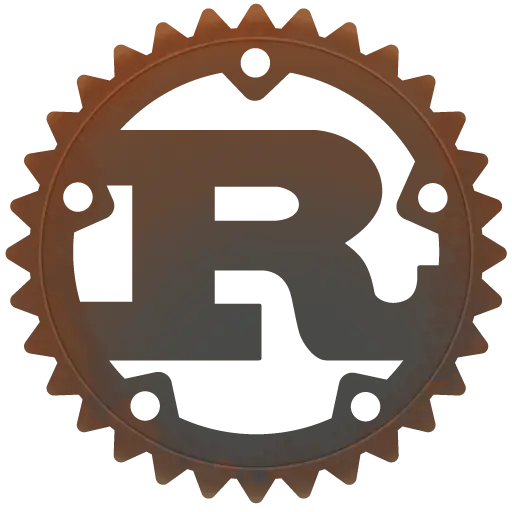

# Hi, I'm Ash

<h2> About Me </h2>

- 🔭 I’m currently working on Mantis Programming Language

- 🌱 I’m currently learning Quantum Computing and web3

- 👯 I’m looking to collaborate on awesome projects

- 💬 Talk to me about anything

- 🤖 Full Stack Developer at 🎭 Lupyd

<h2> Skills  </h2>

### Get in touch with me...
[📫 Mail](mailto://hashtag438@gmail.com)
